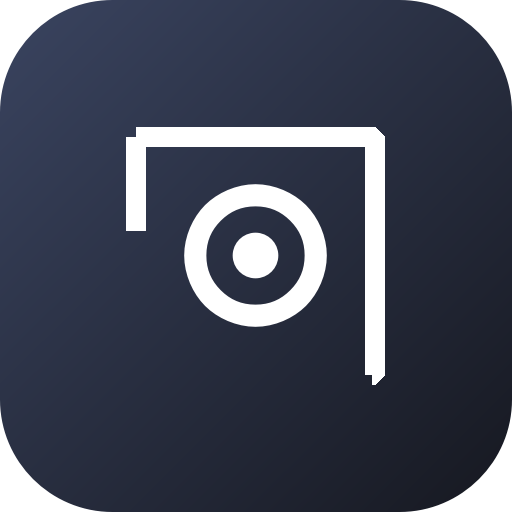
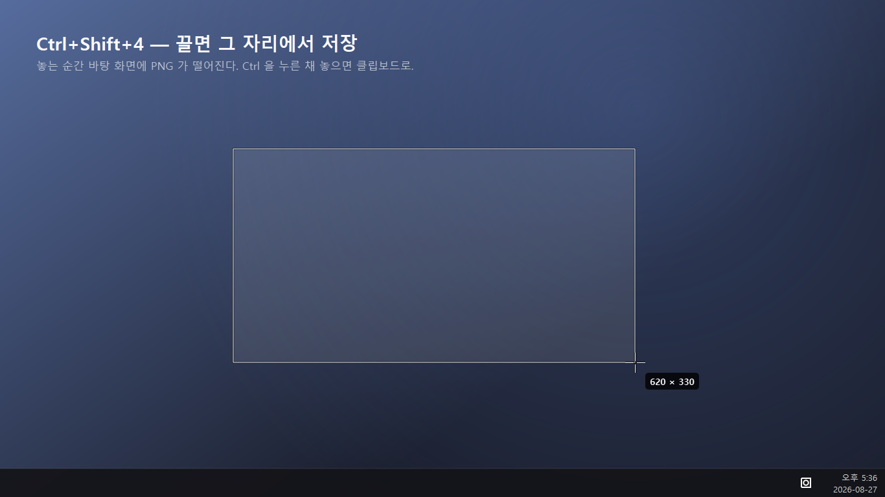
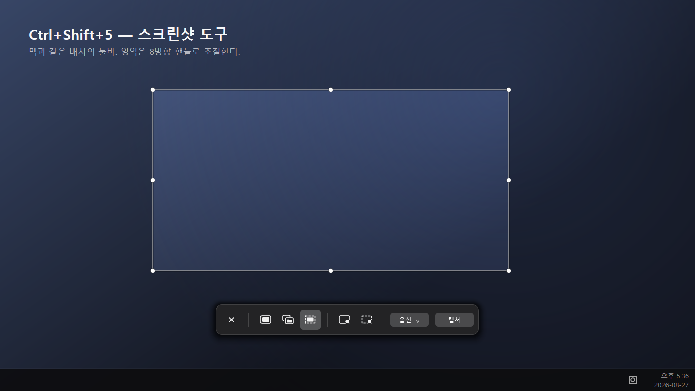
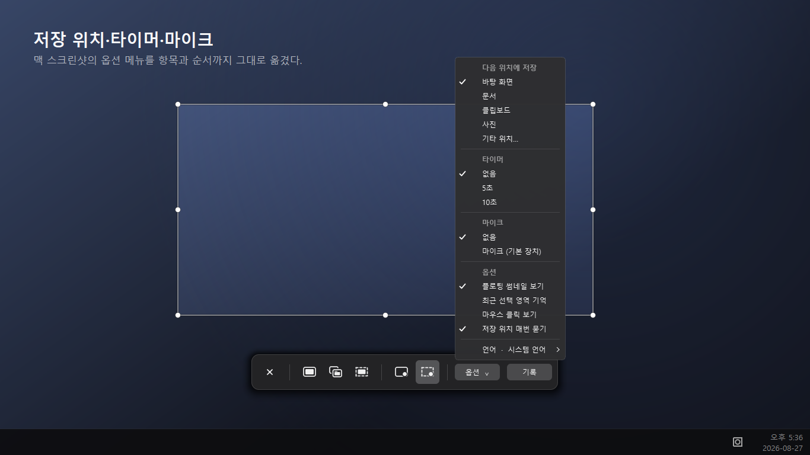
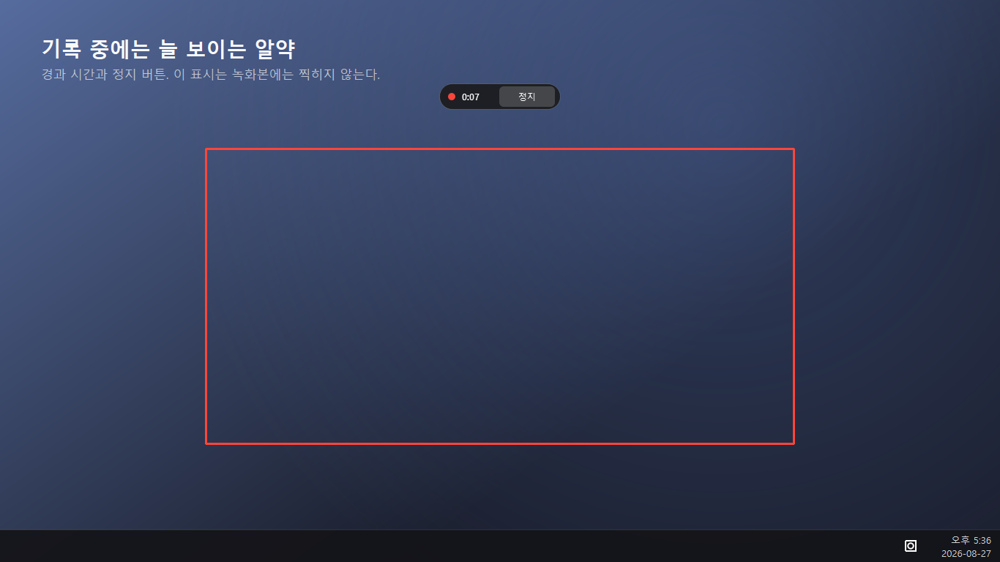
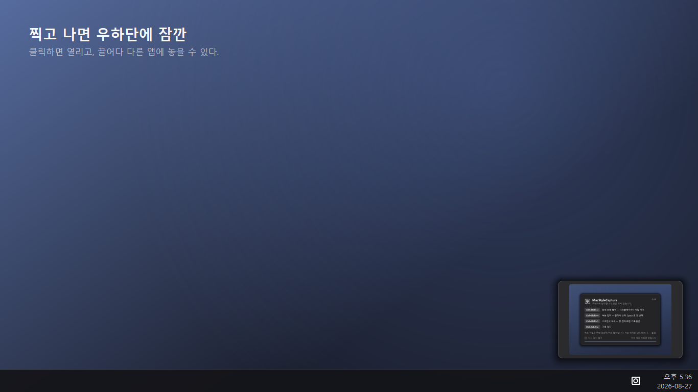
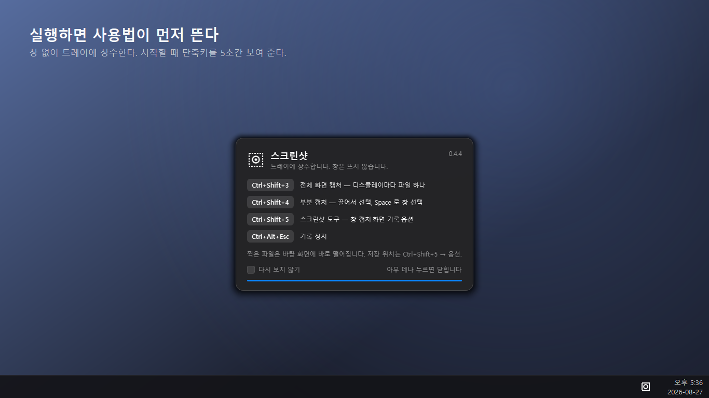
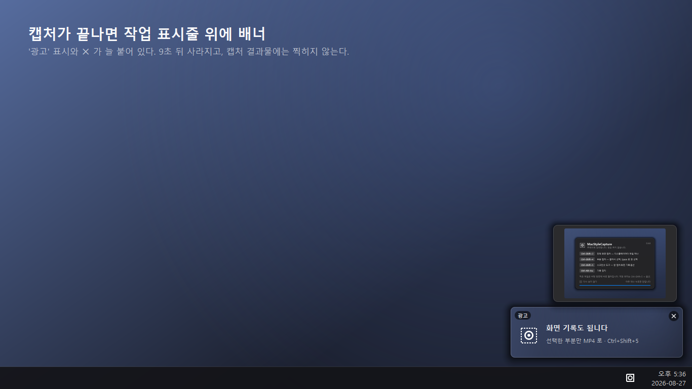

# 截图 · ScreenCapture

**把 Mac 的截图体验搬到 Windows。**
拖出一个区域，PNG 当场就落在桌面上。

[한국어](README.md) · [English](README.en.md) · 简体中文 · [日本語](README.ja.md)

### [⬇ 下载 ScreenCapture.exe（Windows 10 · 11 · 64 位）](https://github.com/develckm86/mac_shot/releases/latest/download/ScreenCapture.exe)

免费 · 免安装 · 无需账号 · 下载后直接运行

需要录屏功能的话，请一并下载 [`ffmpeg.exe`](https://github.com/develckm86/mac_shot/releases/latest/download/ffmpeg.exe) 并放在**同一个文件夹**里。
([两个文件打包的 zip](https://github.com/develckm86/mac_shot/releases/latest/download/ScreenCapture-win64.zip))

<!-- Microsoft Store 上架后，取消下面一行的注释并填入链接。

-->
**Microsoft Store** — 正在准备上架，通过后这里会放上徽章。

---

## 为什么做这个

Windows 也有截图工具，但**保存太麻烦**：先进剪贴板，再点通知，然后打开编辑器，
最后选文件夹。Mac 上拖一下，PNG 就已经在桌面了。这个应用把那套流程搬了过来。

它没有窗口，启动后常驻通知区域，记住快捷键就够了。

## 能做什么

### 拖完就好了 — `Ctrl+Shift+4`

用十字光标拖出范围，松手的瞬间文件就保存了。拖动时一直显示尺寸；松手时按住
`Ctrl`，就复制到剪贴板而不保存文件。

### 和 macOS 一样的工具栏 — `Ctrl+Shift+5`

整个屏幕、窗口、区域截图，加上录制整个屏幕和录制选定区域。选区有八个控制点，
拖动内部可整体移动。

### 保存位置 · 定时器 · 麦克风

macOS 截图的选项菜单，条目和顺序都一样 —— 只多了一项：**语言**。

### 录制中断也不会白录

录制时屏幕顶部会显示已用时间和停止按钮，**这个提示不会被录进视频里**。视频按片段
直接写入磁盘，即使录制途中应用被强制关闭，此前录到的内容依然可以正常播放。

### 截完在右下角停留片刻

点击打开文件，直接拖进别的应用，或者右键：打开 · 在文件夹中显示 · 复制 · 删除。

### 第一次启动会先告诉你怎么用

没有窗口的应用容易让人摸不着头脑。快捷键会在屏幕中央显示 5 秒后自动消失，之后
随时可以从通知区域菜单再看一次。

## 快捷键

把 Mac 的 `Cmd` 换成了 `Ctrl`，其余照搬。

| macOS | Windows | 动作 |
| --- | --- | --- |
| `Cmd+Shift+3` | `Ctrl+Shift+3` | 截取全部显示器 —— 每台一个文件 |
| `Cmd+Shift+4` | `Ctrl+Shift+4` | 拖动截取区域 |
| `Cmd+Shift+4` → `Space` | 相同 | 改为选择窗口 |
| `Cmd+Shift+5` | `Ctrl+Shift+5` | 截图工具栏 |
| `Cmd+Ctrl+Shift+3/4` | `Ctrl+Alt+Shift+3/4` | 复制到剪贴板而不保存文件 |
| `Cmd+Ctrl+Esc` | `Ctrl+Alt+Esc` | 停止录制 |

拖动过程中，`Space`（移动选区）· `Shift`（只改一个方向）· `Alt`（以起点为中心
对称缩放）· `Ctrl`（复制到剪贴板）· `Esc`（取消）的行为与 Mac 完全一致。

## 安装

1. 下载 [`ScreenCapture.exe`](https://github.com/develckm86/mac_shot/releases/latest/download/ScreenCapture.exe)，放到任意文件夹。
2. 双击运行，直接进入通知区域。**无需安装，也不需要管理员权限。**
3. 需要录屏的话，把 [`ffmpeg.exe`](https://github.com/develckm86/mac_shot/releases/latest/download/ffmpeg.exe) 下载到**同一个文件夹**。
   没有它也能截图，只是录屏功能不可用。

不想用了直接删掉文件即可，只有设置会留在 `%APPDATA%\ScreenCapture`。

> 可执行文件没有代码签名，首次运行时 SmartScreen 可能会拦一次：
> 点**更多信息 → 仍要运行**。

## 语言

支持 12 种语言，默认跟随 Windows 显示语言，也可以在选项菜单里手动选择。

한국어 · English · 日本語 · 简体中文 · 繁體中文 · Español · Português ·
Français · Deutsch · Русский · Italiano · Tiếng Việt

各语言的使用说明在 [`docs/manual/`](docs/manual)。

## 关于广告

本应用免费，靠广告维持。**只在截图完成之后**，右下角任务栏上方会出现一个方形横幅，
9 秒后自动消失。

- 顶部始终标明这是广告，并且始终带有 ✕。
- 截图开始前会先收起横幅 —— **绝不会出现在截图或录像里**。
- 不会拖慢或打断截图。没有网络时什么都不显示。
- 除了获取广告图片之外，**不收集也不上传任何数据**。截图和录像只保存在你指定的
  文件夹里。

## 系统要求

| | |
| --- | --- |
| 操作系统 | Windows 10 版本 2004 及以上 / Windows 11（64 位） |
| 权限 | 无需管理员权限 |
| 磁盘 | 约 170 MB（应用 + ffmpeg） |

## 许可与再分发

**任何人都可以原样分发** —— 网站、博客、U 盘、公司内部分发都不需要另外许可。
唯一不允许的是分发去掉广告或替换广告链接的版本，正是广告让这个应用保持免费。
完整条款见 [LICENSE](LICENSE)。

随附的 `ffmpeg.exe` 遵循 FFmpeg 自身的许可证（LGPL/GPL）。

---

遇到问题或想要新功能？欢迎提 <a href="https://github.com/develckm86/mac_shot/issues">issue</a>。

